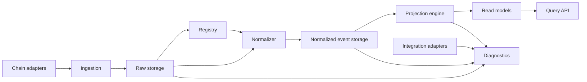

# Kline Service Architecture

Type: Context
Audience: Coding assistants
Authority: High

## Purpose

Canonical target architecture for rebuilding `service/kline` as a coherent service package while preserving current external product behavior and API contracts.

## Facts

- Scope is the whole current `service/kline` package, not only observability
- External compatibility target:
  - preserve currently exposed product APIs and semantics unless explicitly changed
  - preserve existing query-service role as the read path
- Internal compatibility target:
  - no requirement to preserve current table layout
  - no requirement to preserve current module layout
  - no requirement to preserve current `db.py` monolith
- The new architecture may introduce cleaner boundaries, new internal storage, and migration stages
- Observability is one subsystem inside the broader kline service architecture

## Rules

- Do not treat the current `service/kline` internal structure as canonical
- Do not preserve temporary coupling just because it exists today
- Do not mix chain ingestion, domain derivation, query serving, diagnostics, and debug tooling in one monolithic module
- Do not break current product APIs during internal refactor unless the user explicitly approves contract changes
- Do not let query handlers compute correctness-critical state by ad hoc replay of raw history once stable projections exist

## Service Responsibilities

- Chain ingestion:
  - ingest chain facts reliably
  - own replay and catch-up
- Domain normalization:
  - decode and correlate app-specific events
- Market-state derivation:
  - produce settled trades, liquidity changes, positions, fees, and pool state
- Query serving:
  - serve transactions, candles, positions, stats, and diagnostics through stable APIs
- Diagnostics:
  - expose ingestion lag, anomalies, decode failures, projection blockers, and parity gaps
- Debug and operator support:
  - preserve the ability to inspect maker or wallet or pool stalls without contaminating core query logic

## Target Modules

### `ingestion`

- Owns Layer 1 chain fact ingestion
- Reads chain RPC or subscription sources
- Writes raw storage and ingestion cursors

### `registry`

- Owns application discovery and decoder dispatch metadata
- Provides app identity resolution to downstream processors

### `normalizer`

- Converts raw facts plus decode results into normalized domain events

### `projection`

- Owns settled market-state projections
- Responsible for:
  - trades
  - candles
  - pool state
  - position basis
  - fee state
  - protocol stats inputs

### `query`

- Owns read models and public API handlers
- Must read stable projections, not raw chain state

### `diagnostics`

- Owns anomaly queries, lag queries, parity reports, decode failure inspection, and debug exports

### `integration`

- Owns external fetch helpers and service adapters
- Examples:
  - chain RPC adapter
  - optional maker or wallet metrics adapter

## Layering

## Data Domains To Preserve

- transactions history
- candles / kline
- positions
- position metrics
- pool metadata and pool stats
- protocol stats
- fees
- diagnostics and gap analysis
- maker or wallet or pool debug surfaces that are still operationally useful

## Migration Principles

- External API first:
  - preserve outputs while replacing internals
- Projection first:
  - move correctness into stable derived state
- Query last:
  - handlers should switch after projections are trustworthy
- Debug isolation:
  - diagnostic and operator endpoints should depend on dedicated diagnostic models, not random core internals

## Implications

- Observability docs define only the ingestion-to-projection truth pipeline
- Additional kline architecture work must cover:
  - query module boundaries
  - stats projections
  - diagnostics surfaces
  - maker debug integration boundaries
- A clean rebuild is allowed if it preserves current product behavior

## Checklist

1. Define the whole-service target module map
2. Place observability as one subsystem inside it
3. Define which current APIs map to which read models
4. Define which debug surfaces stay in the core service versus a diagnostics module
5. Plan migration from monolith to modular package without breaking public contracts

## Sources

- `agents/context/system-map.md`
- `agents/context/current-capabilities.md`
- `agents/context/observability-architecture.md`
- `agents/runbooks/observability-product-mapping.md`
