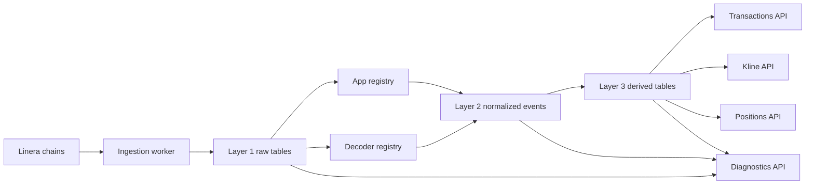

# Observability Architecture

Type: Context
Audience: Coding assistants
Authority: High

## Purpose

Canonical architecture for the chain observability system that removes `latestTransactions` entirely from `service/kline`.

## Facts

- Scope:
  - `service/kline` observability subsystem
  - future chain-ingestion worker(s)
  - MySQL persistence for raw facts, normalized events, and derived market data
- Parent service architecture:
  - `agents/context/kline-service-architecture.md`
- Primary external reference:
  - `linera-protocol/linera-explorer-new`
- `round` is not a primary identity dimension for blocks, bundles, or business events
- Chain progress is tracked by `chain_id + height`
- Cross-chain linkage is tracked with source-side certificate and transaction dimensions
- Kline semantics follow standard exchange semantics:
  - only settled trades enter candles
  - requests, pending actions, and rejects do not enter candles
- Real-time progression should be event-driven from chain notifications or equivalent subscription signals
- Catch-up is a compensating path, not a primary polling loop
- This repository treats the observability stack as a complete data platform
  - producer data comes only from parsed chain blocks
  - normalized business facts come only from Layer 2 events
  - consumer-facing business data comes only from Layer 3 projections

## Semantics

- Layer 1 is raw chain fact storage
  - stores only chain facts
  - preserves raw bytes for user operations and messages
  - does not infer business success
- Layer 2 is normalized domain events
  - decodes known application payloads
  - correlates chain facts into business events
  - preserves explicit rejected and undecodable states
- Layer 3 is derived market state
  - powers `transactions`, `candles`, `positions`, `fees`, and diagnostics
  - only consumes finalized business events that satisfy product semantics
  - product-facing HTTP and websocket read paths must consume Layer 3 projections or explicit projection-backed snapshots/replay facts only
  - current first-stage new-trade/liquidity fact carrier is block-observed `PoolMessage::NewTransaction`
  - pool catalog is a Layer 3 projection from observed swap pool-created events
  - `pool_catalog_v2.pool_id` is a stable read-model identity assigned by the projection, not a protocol or swap GraphQL `poolId`
  - `latestTransactions` state is not a truth source
  - future upstream class-EVM-event-like capabilities may replace `NewTransaction`, but are not required for the first-stage system

## Flow

## Implications

- Observability is not the whole kline architecture
- Query serving, diagnostics packaging, and non-observability read models belong to the broader `service/kline` architecture
- Do not use observability work as a reason to grow compensating business logic around unresolved read-model design; downstream product reads must be driven by explicit Layer 2 and Layer 3 concepts
- Producer/consumer contract:
  - producer facts must come only from chain block parsing
  - consumer business data must come only from projections
  - product handlers, websocket feeds, frontend APIs, maker analytics, and reconciliations must not use live chain GraphQL as business truth
- Do not derive `transactions`, `candles`, `positions`, `fees`, or `position-metrics` from `latestTransactions`
- Do not keep `latestTransactions` as a fallback, auxiliary source, live merge input, audit bridge, parity input, or diagnostics shortcut
- In the current stage, use block-observed `PoolMessage::NewTransaction` as the Layer 3 execution fact carrier
- Do not read pool `latestTransactions` state, snapshot windows, or any equivalent transaction-history list as product truth
- Keep the carrier boundary explicit so future upstream event-like capabilities can replace `NewTransaction` without changing Layer 3 product semantics
- All product and observability facts must come from block ingestion and block-parsed downstream projections
- Do not let public query handlers read pool-application GraphQL for product history, recent windows, or diagnostics once projection-backed read models exist
- Do not let public query handlers, stats readers, or position/fee/tvl calculators use live pool, swap, or wallet queries to decide business existence, ownership, price, volume, fee, liquidity, or ranking semantics
- Live chain queries are allowed only for:
  - explicit debug or operations endpoints
  - chain-health diagnostics
  - temporary bootstrap paths that are clearly marked as non-truth and scheduled for removal
- `ticker` is a projection consumer only
  - it may read persisted pool transaction history and candles
  - it must not perform chain-history repair, recent-window backfill, or pool-application transaction queries
  - it must not use live pool queries as the source of product-facing pool or market truth
- Do not preserve schema-compatibility query fallbacks in product read paths once the target pool-application schema is part of the supported rollout contract
- Do not parse application payload bytes in Layer 1
- Do not use `round` as a cursor, dedup key, or event primary key
- Keep explorer-style object boundaries:
  - blocks
  - incoming bundles
  - posted messages
  - operations
  - outgoing messages
  - events
  - oracle responses
- Preserve both source-side and target-side dimensions for incoming bundles
- Do not make cron or periodic polling the primary ingestion driver
- Use catch-up only for:
  - service startup reconciliation
  - subscription reconnect reconciliation
  - explicit admin-triggered repair
  - detected lag or gap recovery
- Keep manual admin triggers available for diagnostics, but do not treat them as steady-state execution

## Checklist

1. Design Layer 1 schema first
2. Define cursor advancement and replay guarantees
3. Define application registry and decoder registry before Layer 2 implementation
4. Define `settled_trade` before Kline migration
5. Migrate product-facing tables only after Layer 1 and Layer 2 are stable

## Sources

- `https://github.com/linera-io/linera-protocol/tree/main/linera-explorer-new`
- `https://github.com/linera-io/linera-protocol/blob/main/linera-explorer-new/server-rust/src/db.rs`
- `https://github.com/linera-io/linera-protocol/blob/main/linera-explorer-new/server-rust/src/models.rs`
- `https://github.com/linera-io/linera-protocol/blob/main/linera-chain/src/manager.rs`
- `agents/tasks/board.yaml` (`POS-026`, `FUND-001`)
