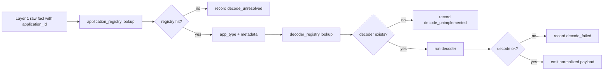

# Application Registry And Decoding

Type: Primitive
Audience: Coding assistants
Authority: High

## Purpose

Canonical design for `application_registry`, `decoder_registry`, and payload decoding in the observability system.

## Facts

- Scope:
  - Layer 2 input preparation
  - application identification
  - payload decoding for known app types
- Raw ingestion remains valid even when decoding is unavailable
- `decoder_registry` is a code-level registry, not a required standalone service
- `application_registry` is persistent data, not a hard-coded map

## Semantics

- `application_registry` answers:
  - what app an `application_id` belongs to
  - what app type it is
  - what contextual metadata is known for decoding and correlation
- `decoder_registry` answers:
  - given `app_type` and `payload_kind`, which decoder to use
- Decoder implementations answer:
  - whether raw bytes decode successfully
  - what structured payload was found

## Rules

- Do not put `decoder_registry` in the database in the first implementation
- Do not block Layer 1 ingestion on missing registry entries or decode failures
- Do not require a separate microservice for decoder dispatch in the first implementation
- Do not infer `app_type` from raw bytes alone when `application_registry` can provide it
- Do not drop undecodable payloads; preserve them as raw facts and explicit decode failures

## Flow

## `application_registry`

### Purpose

- Persist runtime knowledge of known application identities and types

### Required Columns

- `application_id` `varchar(128)` not null
- `app_type` `varchar(64)` not null
- `chain_id` `varchar(64)` null
- `creator_chain_id` `varchar(64)` null
- `owner` `varchar(128)` null
- `parent_application_id` `varchar(128)` null
- `abi_version` `varchar(32)` null
- `discovered_from` `varchar(64)` not null
- `status` `varchar(32)` not null
- `metadata_json` `json` null
- `first_seen_at` `datetime(6)` not null
- `last_seen_at` `datetime(6)` not null
- `updated_at` `datetime(6)` not null

### Primary Key

- `application_id`

### Secondary Indexes

- `(app_type, status)`
- `(creator_chain_id)`
- `(parent_application_id)`

### Source Types

- `static_config`
- `swap_service`
- `proxy_service`
- `chain_event`
- `manual`

### Status Values

- `active`
- `unknown`
- `deprecated`

## `decoder_registry`

### Purpose

- Map known `app_type` and `payload_kind` pairs to decoder implementations

### First Implementation Form

- In-process code registry
- Example dimensions:
  - `pool + operation`
  - `pool + message`
  - `swap + operation`
  - `swap + message`
  - `meme + operation`
  - `meme + message`
  - `proxy + operation`
  - `proxy + message`

### Notes

- `payload_kind` is one of:
  - `operation`
  - `message`
  - optionally later:
    - `event`
- A future version may add `abi_version` dispatch
- The first version should not add network RPC boundaries

## Decoder Implementation Boundary

- Recommended first implementation:
  - Python orchestration
  - Rust helper for ABI/BCS decoding of known app payloads
- Expected decoder outputs:
  - `decoded_payload_json`
  - `payload_type`
  - `decode_error`
  - optional version hints

## Validation

- Unknown `application_id` must not block processing of the raw fact
- Missing decoder must produce explicit unresolved or unimplemented state
- Decode failure must be queryable later through diagnostics
- A registry update must allow re-decoding old raw facts without re-ingesting Layer 1

## Sources

- `agents/context/observability-architecture.md`
- `agents/primitives/market-data-semantics.md`
- `agents/tasks/board.yaml` (`POS-033`)
