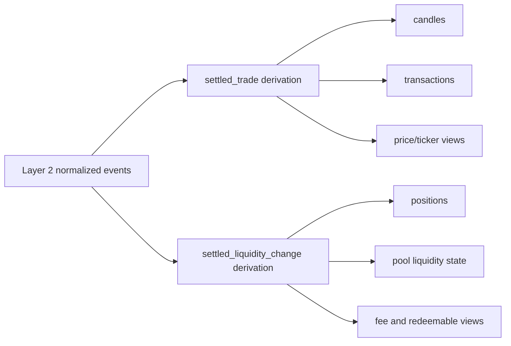

# Derived Market State

Type: Primitive
Audience: Coding assistants
Authority: High

## Purpose

Canonical Layer 3 model for product-facing market data derived from normalized events.

## Facts

- Layer 3 is the only source for product-facing `transactions`, `candles`, `positions`, and `fees`
- Layer 3 consumes Layer 2 normalized events, not raw bytes
- Kline semantics follow standard exchange semantics
- `latestTransactions` must not remain a truth source once Layer 3 is active

## Semantics

- `settled_trade` is the only valid candle input
- `settled_liquidity_change` is the canonical input for position and liquidity derivation
- Product tables may remain physically separate from Layer 3 event tables
- Product views are valid only if they can be explained backward from Layer 3 to Layer 2 and then to Layer 1
- `settled_trade` and `settled_liquidity_change` must be derived from real pool execution facts observed in blocks
- Current first-stage carrier is block-observed `PoolMessage::NewTransaction`
- This carrier is temporary and may later be replaced by official class-EVM-event-like capabilities when available upstream
- Current Layer 3 runtime consumes decoded `PoolMessage::NewTransaction.transaction`
  - required decoded payload shape:
    - `transaction.transaction_id`
    - `transaction.transaction_type`
    - `transaction.created_at_micros`
    - `transaction.from.chain_id`
    - `transaction.from.owner`
  - trade fields:
    - `transaction.amount_0_in`
    - `transaction.amount_0_out`
    - `transaction.amount_1_in`
    - `transaction.amount_1_out`
  - liquidity fields:
    - `transaction.liquidity`
    - `transaction.amount_0_in` or `transaction.amount_0_out`
    - `transaction.amount_1_in` or `transaction.amount_1_out`

## Rules

- Do not derive candles from requests, pending actions, or rejected events
- Do not derive positions from raw pool history once Layer 3 is authoritative
- Do not let `transactions` mix Layer 1 reject facts with settled trade rows unless the UI explicitly models multiple statuses
- Do not keep direct `latestTransactions` reads in `ticker`, `candles`, `positions`, or `fees` after Layer 3 migration
- Do not let Layer 3 depend on pool `latestTransactions` state or any equivalent transaction-history snapshot path
- It is acceptable in the current stage for Layer 3 to depend on block-observed `PoolMessage::NewTransaction`
  while that remains the contract's final execution-fact carrier

## Flow

## `settled_trade`

### Meaning

- A finalized trade event that satisfies product semantics for execution
- Valid for Kline, trade history, and price/ticker derivation

### Minimum Fields

- `settled_trade_id`
- `pool_application_id`
- `pool_chain_id`
- `block_hash`
- `trade_time_ms`
- `transaction_index`
- `side`
- `amount_in`
- `amount_out`
- `price_numerator`
- `price_denominator`
- `source_event_key`
- `created_at`

### Required Properties

- Idempotent replay
- Stable ordering within a pool
- Traceable back to Layer 2 correlation keys
- Must be explainable from the current `NewTransaction.transaction` contract, not ad-hoc per-consumer field probing

### Invalid Inputs

- request-only swap observations
- pending payout or pending commit states
- rejected incoming bundles
- decode failures
- any source other than block-observed `NewTransaction.transaction`

## `settled_liquidity_change`

### Meaning

- A finalized liquidity delta that satisfies product semantics
- Valid for positions, pool liquidity views, and downstream fee calculations
- Must come from block-observed `NewTransaction.transaction` liquidity facts, not from pool state snapshots

### Minimum Fields

- `settled_liquidity_change_id`
- `pool_application_id`
- `pool_chain_id`
- `owner`
- `block_hash`
- `event_time_ms`
- `transaction_index`
- `change_type`
- `liquidity_delta`
- `amount_0_delta`
- `amount_1_delta`
- `source_event_key`
- `created_at`

### Required Properties

- Idempotent replay
- Traceable back to Layer 2 correlation keys
- Distinguishes add and remove semantics
- Must be explainable from the current `NewTransaction.transaction` contract, not ad-hoc per-consumer field probing

## Product-Facing Outputs

### `transactions`

- Source:
  - `settled_trade`
  - optionally explicit non-trade Layer 3 entries if the UI needs multiple settled business types
- Must not depend on `latestTransactions`

### `candles`

- Source:
  - `settled_trade`
- Fields:
  - open
  - high
  - low
  - close
  - base volume
  - quote volume
- Must not be updated by rejected or pending activity

### `positions`

- Source:
  - `settled_liquidity_change`
  - finalized fee/redeemable derivations built on top of Layer 3
- Must not depend on raw transaction-history replay once migrated

### `fees`

- Source:
  - finalized Layer 3 state derived from settled trades and settled liquidity changes
- Must not consume unresolved or rejected execution paths

## Validation

- Replaying the same normalized events must not change settled output rows
- Removing `latestTransactions` from Kline paths must not change settled candle semantics
- A rejected swap observation must not create a `settled_trade`
- A finalized liquidity change must be enough to explain a position delta without re-reading raw chain bytes

## Sources

- `agents/primitives/market-data-semantics.md`
- `agents/primitives/normalized-event-model.md`
- `agents/tasks/board.yaml` (`POS-035`)
