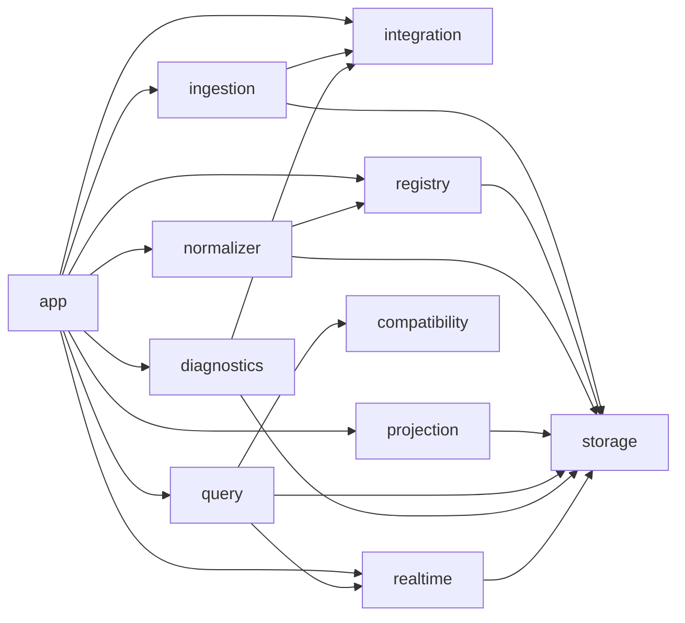

# Kline Package Layout

Type: Primitive
Audience: Coding assistants
Authority: High

## Purpose

Canonical target package layout, dependency direction, and module-boundary rules for rebuilding `service/kline`.

## Facts

- This file defines the internal package structure of the rebuilt kline service
- Public API compatibility does not require preserving current file layout
- The current `service/kline/src/db.py` monolith is not canonical
- Observability is one subsystem inside the package, not the package itself

## Rules

- Do not create a new monolithic `db.py` or equivalent god module
- Do not let `query` import chain RPC adapters directly
- Do not let `query` import raw storage models directly
- Do not let `diagnostics` mutate projection state
- Do not let `integration` import `query`
- Do not let projection logic live inside FastAPI handlers
- Do not let package boundaries depend on “current convenience”; follow dependency direction only

## Target Layout

```text
service/kline/src/
  app/
    bootstrap.py
    config.py
    lifecycle.py
  integration/
    chain_client.py
    swap_client.py
    wallet_client.py
    metrics_client.py
  ingestion/
    coordinator.py
    fetcher.py
    persistence.py
    cursors.py
    anomalies.py
  registry/
    application_registry.py
    decoder_registry.py
    decoder_runner.py
  normalizer/
    normalizer.py
    correlation.py
    event_builders/
  projection/
    trades/
    candles/
    pools/
    positions/
    fees/
    stats/
    projector.py
  query/
    api.py
    handlers/
    serializers/
    read_models/
  diagnostics/
    api.py
    handlers/
    read_models/
    inspectors/
  storage/
    mysql/
      connection.py
      raw_repo.py
      normalized_repo.py
      projection_repo.py
      diagnostics_repo.py
    models/
  realtime/
    websocket_hub.py
    publisher.py
  compatibility/
    legacy_response_shapes.py
    endpoint_aliases.py
```

## Module Responsibilities

### `app`

- Owns process bootstrap, configuration, and lifecycle wiring
- Must not contain business derivation logic

### `integration`

- Owns external system adapters
- Must be stateless or lightly stateful wrappers around remote calls
- Must not own projection logic

### `ingestion`

- Owns Layer 1 orchestration
- Reads from `integration`
- Writes through `storage`

### `registry`

- Owns application metadata and decoder lookup
- Must not own normalized-event persistence beyond decode result handoff

### `normalizer`

- Owns Layer 2 event creation
- Reads raw facts and decode outputs
- Writes normalized events through `storage`

### `projection`

- Owns settled and read-model source projections
- Reads normalized events
- Writes projection state through `storage`

### `query`

- Owns public product API handlers
- Reads stable read models only
- Serializes compatibility responses

### `diagnostics`

- Owns diagnostic and operator-facing endpoints
- Reads raw, normalized, projection, and external inspection models as needed
- Must not become a second projection engine

### `storage`

- Owns persistence interfaces and implementations
- Should be split by data layer and concern
- Must not contain HTTP or FastAPI code

### `realtime`

- Owns websocket fan-out and push events
- Reads projection-triggered events or read-model deltas
- Must not compute candles or transactions on its own

### `compatibility`

- Owns temporary adapters that preserve old response shapes and aliases during migration
- Must be removable after cutover

## Dependency Direction



## Forbidden Dependencies

- `query -> integration.chain_client`
- `query -> ingestion`
- `query -> normalizer`
- `query -> projection` for write operations
- `projection -> fastapi`
- `storage -> fastapi`
- `integration -> query`
- `diagnostics -> projection` for mutation paths

## Packaging Notes

- The first migration does not require physically creating every directory immediately
- The first step is to align new code with these boundaries
- Temporary bridge modules are allowed only if:
  - they are explicit
  - they live under `compatibility`
  - they are not treated as permanent architecture

## Validation

- Every new file added during refactor belongs to one target package area above
- No new handler computes correctness-critical state from raw history
- No new storage helper grows into a cross-layer god object
- Diagnostic code can be removed or moved without breaking core query correctness

## Sources

- `agents/context/kline-service-architecture.md`
- `agents/runbooks/kline-service-migration.md`
- `agents/runbooks/kline-capability-mapping.md`
