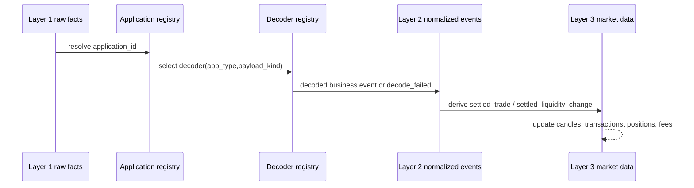

# Market Data Semantics

Type: Primitive
Audience: Coding assistants
Authority: High

## Purpose

Canonical semantics for normalized events, decoder responsibilities, and the derived market-data layer.

## Facts

- Kline semantics match standard exchange semantics
- `settled_trade` is the only valid candle input
- Layer 2 must decode known application payloads for:
  - `pool`
  - `swap`
  - `meme`
  - `proxy`
  - `ams`
  - `blob-gateway`
- Unknown or undecodable user payloads must remain available as raw facts

## Semantics

- Application registry maps `application_id` to app type and discovery metadata
- Decoder registry maps app type plus payload kind to a decoder
- Decoder failures create explicit decode-failure facts; they do not block raw ingestion
- Normalized business events may include:
  - `swap_message_observed`
  - `swap_message_rejected`
  - `fund_success_recorded`
  - `fund_fail_recorded`
  - `transaction_recorded`
  - `liquidity_change_recorded`
- Derived market events are stricter than normalized business events
- `settled_trade` means:
  - a trade is finalized under product semantics
  - the event is allowed to affect candles and trade history
- Requests, pending states, and rejects are not settled trades

## Flow

## Rules

- Do not let Layer 3 consume raw bytes directly
- Do not let candles consume requests, pending actions, or rejects
- Do not let decode failures block Layer 1 persistence
- Do not assume all user payloads are decodable without an application registry entry
- Do not treat a raw `Swap`-related fact as a settled trade without explicit Layer 2 to Layer 3 rules

## Checklist

1. Define `application_registry`
2. Define `decoder_registry`
3. Define normalized event schemas and correlation keys
4. Define `settled_trade`
5. Define `settled_liquidity_change`
6. Re-point existing `transactions`, `candles`, `positions`, and `fees` derivation to Layer 3

## Validation

- A raw swap request without final settlement must not create a candle
- A rejected incoming bundle must not create a settled trade
- A decode failure must remain queryable through diagnostics
- A settled trade replay must be idempotent

## Sources

- `agents/context/observability-architecture.md`
- `agents/primitives/observability-storage.md`
- `agents/primitives/cross-chain.md`
- `agents/tasks/board.yaml` (`POS-026`, `FUND-001`)
