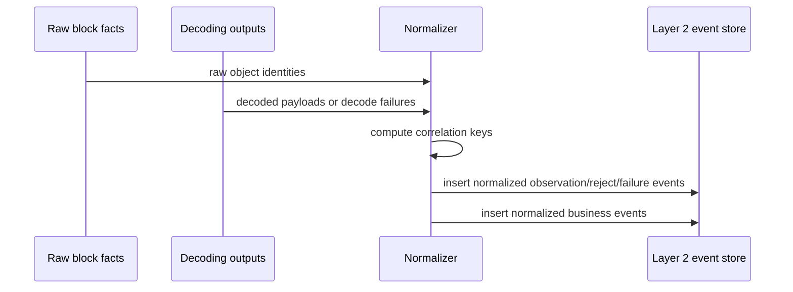

# Normalized Event Model

Type: Primitive
Audience: Coding assistants
Authority: High

## Purpose

Canonical Layer 2 event model for turning raw chain facts into business-oriented normalized events.

## Facts

- Layer 2 consumes Layer 1 raw facts plus decoding outputs
- Layer 2 is still factual; it is not yet market-data derivation
- Layer 2 must preserve explicit rejected and decode-failure states
- Layer 3 depends on Layer 2 for `settled_trade` and `settled_liquidity_change`

## Semantics

- A normalized event must be reproducible from Layer 1 facts and decoder outputs
- A normalized event must have a stable correlation key
- A normalized event may describe:
  - observation
  - rejection
  - decode failure
  - recorded transaction history
  - recorded liquidity change
- A normalized event is not automatically a settled market event

## Correlation Keys

### Base Keys

- `block_key`
  - `chain_id + height`
- `block_hash`
  - canonical block identity
- `incoming_bundle_source_key`
  - `origin_chain_id + source_cert_hash + transaction_index`
- `posted_message_key`
  - `origin_chain_id + source_cert_hash + transaction_index + message_index`
- `outgoing_message_key`
  - `block_hash + transaction_index + message_index`

### Domain Correlation Key

- Purpose:
  - join multiple Layer 1 facts that belong to the same business execution
- First implementation form:
  - deterministic composite string
- Suggested shape:
  - `app_type + primary_chain_id + source_cert_hash + transaction_index + semantic_role`

## Event Families

### Infrastructure Events

- `decode_unresolved`
- `decode_unimplemented`
- `decode_failed`

### Message Observation Events

- `incoming_bundle_observed`
- `incoming_bundle_rejected`
- `posted_message_observed`

### Pool/Swap/Meme Domain Events

- `pool_swap_message_observed`
- `pool_swap_message_rejected`
- `pool_add_liquidity_message_observed`
- `pool_remove_liquidity_message_observed`
- `fund_success_recorded`
- `fund_fail_recorded`
- `transaction_recorded`
- `liquidity_change_recorded`

## Rules

- Do not collapse Layer 2 and Layer 3 semantics into a single table
- Do not label a normalized event as `settled_trade` unless it satisfies Layer 3 rules
- Do not drop `Reject` information when converting raw facts into normalized events
- Do not assume one raw message equals one business event; correlation may span multiple facts
- Do not require all Layer 2 events to be decodable from user payloads alone

## Flow

## Validation

- Reprocessing the same raw inputs must not create duplicate normalized events
- A `Reject` path must stay visible in Layer 2 even if no product view consumes it
- A decode failure must remain separate from a business rejection
- A single incoming bundle may generate multiple Layer 2 events if multiple messages matter

## Sources

- `agents/context/observability-architecture.md`
- `agents/primitives/application-decoding.md`
- `agents/primitives/market-data-semantics.md`
- `agents/tasks/board.yaml` (`POS-034`)
