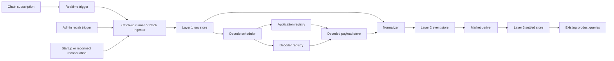

# Observability Interfaces

Type: Primitive
Audience: Coding assistants
Authority: High

## Purpose

Canonical module-interface contract for Layer 1 ingestion, Layer 2 decoding and normalization, and Layer 3 market derivation.

## Facts

- This file defines in-process or service-local interfaces, not external public APIs
- First implementation remains Python-led
- Decoder execution may call a Rust helper, but orchestration boundaries stay here
- Canonical storage and semantic rules remain in:
  - `agents/primitives/observability-storage.md`
  - `agents/primitives/application-decoding.md`
  - `agents/primitives/normalized-event-model.md`
  - `agents/primitives/derived-market-state.md`

## Rules

- Do not let downstream layers read chain RPC directly when Layer 1 already persists the same fact
- Do not pass raw bytes directly from Layer 1 into Layer 3
- Do not couple registry refresh with block ingestion success
- Do not require synchronous end-to-end completion across all layers for one block commit
- Do not hide replay mode from downstream processors; every processor must know whether it is running incremental or catch-up work
- Do not make cron or periodic polling the primary ingestion trigger
- Treat startup reconciliation, subscription reconnect, explicit admin repair, and detected lag as catch-up triggers
- For Linera public service integration, prefer the native GraphQL notification subscription over synthetic tip polling
- Do not let Layer 1 observability startup, catch-up, or debug persistence prevent core query API startup
- Observability workers and operator endpoints must fail open: on dependency or storage failure they may expose degraded status, but must not terminate the broader `service/kline` process
- Future Layer 2 and Layer 3 workers must report into the same observability status surface instead of inventing separate health or recovery protocols

## Flow

## Interfaces

### Block Ingestor

- Responsibilities:
  - fetch confirmed block by `chain_id + height`
  - persist all Layer 1 rows for that block
  - advance `chain_cursors` atomically
  - preserve fail-open service behavior when ingestion dependencies are unavailable
- Input contract:
  - `chain_id`
  - `height`
  - trigger reason:
    - `notification`
    - `startup_reconcile`
    - `reconnect_reconcile`
    - `admin_repair`
    - `lag_recovery`
  - optional mode:
    - `live`
    - `catch_up`
    - `replay`
- Output contract:
  - `block_hash`
  - `chain_id`
  - `height`
  - `ingest_status`
  - `raw_write_summary`
  - `cursor_advanced`
- Failure contract:
  - if any Layer 1 child write fails, commit must not happen
  - if a uniqueness conflict implies shape mismatch, emit ingestion anomaly and stop cursor advancement
  - ingestion failure must not be allowed to take down the query-serving process; degradation must remain local to the observability subsystem

### Decode Scheduler

- Responsibilities:
  - select Layer 1 rows with `application_id`
  - resolve registry entries
  - run decoder or record decode status
- Input contract:
  - raw row identity:
    - `operation_id` or `posted_message_id` or equivalent raw key
  - `application_id`
  - `payload_kind`
  - `raw_bytes`
  - `reprocess_reason`
- Output contract:
  - `decode_status`
  - `application_id`
  - `app_type`
  - `payload_kind`
  - `payload_type`
  - `decoded_payload_json`
  - `decode_error`
  - `decoder_version`
- Decode status values:
  - `decoded`
  - `unresolved_application`
  - `unimplemented_decoder`
  - `decode_failed`

### Application Registry Resolver

- Responsibilities:
  - map `application_id` to app metadata
  - allow later backfill or correction
- Input contract:
  - `application_id`
- Output contract:
  - `registry_status`
  - `app_type`
  - `chain_id`
  - `creator_chain_id`
  - `metadata_json`
  - `abi_version`
- Rules:
  - misses must be explicit
  - registry updates must not require raw re-ingestion

### Normalizer

- Responsibilities:
  - join Layer 1 facts and decode results
  - emit Layer 2 events with stable correlation keys
  - advance its own `processing_cursors` checkpoint independently from Layer 1
- Input contract:
  - raw object identity keys
  - decode result
  - optional app metadata
- Output contract:
  - `normalized_event_id`
  - `event_family`
  - `event_type`
  - `correlation_key`
  - `source_chain_id`
  - `target_chain_id`
  - `source_block_hash`
  - `target_block_hash`
  - `source_cert_hash`
  - `transaction_index`
  - `message_index`
  - `event_payload_json`
  - `normalization_status`
- Normalization status values:
  - `observed`
  - `rejected`
  - `decode_failed`
  - `derived`
- First implementation note:
  - a synchronous `normalization_worker` may own `decode_scheduler -> normalized_event_materializer -> processing_cursor_repository` as one local boundary before background workers are introduced
  - a `normalization_replay_driver` may select Layer 1 candidates per raw-table partition and feed them into the same worker boundary

### Market Deriver

- Responsibilities:
  - transform Layer 2 into Layer 3 settled outputs
  - materialize product-facing derived state
- Input contract:
  - normalized events by ordered cursor
  - derivation mode:
    - `incremental`
    - `rebuild`
- Output contract:
  - `settled_output_type`
  - `settled_output_id`
  - `source_event_key`
  - `derivation_status`
  - `product_projection_updates`
- Derivation status values:
  - `settled`
  - `ignored_non_settled`
  - `blocked_missing_context`
  - `inconsistent_source`

## Processing Cursors

### Layer 1 Cursor

- Key:
  - `chain_id`
- Meaning:
  - highest fully committed block in raw storage

### Decode Cursor

- Key:
  - decoder worker name plus raw-table partition
- Meaning:
  - highest raw identity fully evaluated for decode status

### Normalize Cursor

- Key:
  - normalizer worker name plus source partition
- Meaning:
  - highest raw or decode sequence fully materialized into Layer 2
- First implementation:
  - `last_sequence` may be the latest `raw_fact_id`
  - `last_block_hash` may be the latest source or target block hash carried by the batch

### Derive Cursor

- Key:
  - derivation job plus market projection
- Meaning:
  - highest Layer 2 sequence fully reflected in Layer 3

## Replay Semantics

- Layer 1 replay:
  - re-fetch same block
  - rely on storage uniqueness
  - may be initiated by admin repair, startup reconciliation, reconnect reconciliation, or detected lag

## Notification Source

- Preferred transport:
  - Linera GraphQL subscription over WebSocket with `graphql-transport-ws`
- Preferred trigger:
  - any chain notification for a subscribed chain should enqueue bounded catch-up
- Reconnect rule:
  - after a subscription reconnect, run bounded catch-up before trusting live notifications again
- Decode replay:
  - rerun decode after registry or decoder update
  - replace or supersede decode result for the same raw identity
- Normalize replay:
  - recompute events for one raw identity or one chain range
  - preserve stable correlation keys
  - first implementation may replay per raw table such as `raw_operations` and `raw_posted_messages` before introducing a richer global sequence
- Derive replay:
  - rebuild one pool, one owner, or one global projection from Layer 2

## Validation

- A Layer 1 commit must succeed or fail as a whole block
- A decode retry must not require deleting Layer 1 rows
- A normalizer retry must reproduce the same correlation key
- A Layer 3 rebuild must be possible using Layer 2 only

## Sources

- `agents/primitives/observability-storage.md`
- `agents/primitives/application-decoding.md`
- `agents/primitives/normalized-event-model.md`
- `agents/primitives/derived-market-state.md`
- `agents/runbooks/observability-deliverables.md`
- `agents/runbooks/observability-fail-open-operations.md`
