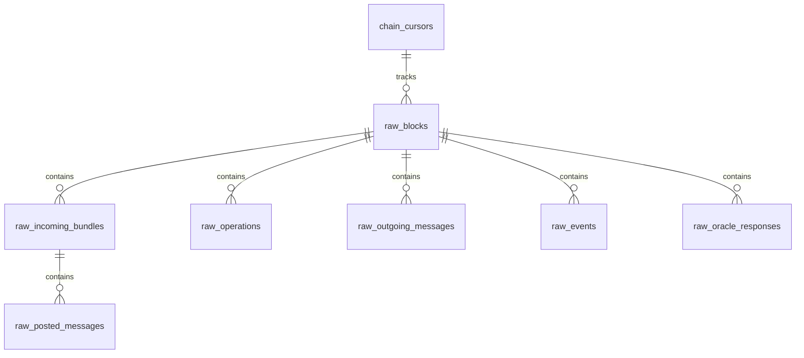

# Observability Schema Draft

Type: Primitive
Audience: Coding assistants
Authority: High

## Purpose

Canonical Layer 1 schema draft for the explorer-style observability system.

## Facts

- Scope:
  - MySQL raw fact storage
  - Layer 1 only
- Canonical architecture:
  - `agents/context/observability-architecture.md`
- Canonical storage semantics:
  - `agents/primitives/observability-storage.md`
- Existing product-facing tables such as `transactions`, `pool`, `candles`, and `positions` are not Layer 1 tables

## Semantics

- `raw_blocks` is the block fact table
- `raw_incoming_bundles` is the destination-chain receipt table for incoming bundles
- `raw_posted_messages` is the message table nested under incoming bundles
- `raw_operations` is the operation table for block-local operations
- `raw_outgoing_messages` is the block-local outgoing message table
- `raw_events` is the block-local event table
- `raw_oracle_responses` is the block-local oracle response table
- `chain_cursors` is the per-chain ingestion progress table

## Flow

## Rules

- Do not add business-state columns such as `settled`, `trade_side`, `position_status`, or `fee_amount` to Layer 1 tables
- Do not use `round` as a primary key, unique key, or cursor field
- Do not advance `chain_cursors` outside the same transaction that writes the corresponding block facts
- Do not overwrite conflicting rows on unique-key mismatch

## Schema

### `chain_cursors`

- Purpose:
  - per-chain ingestion progress
- Columns:
  - `chain_id` `varchar(64)` not null
  - `last_finalized_height` `bigint` null
  - `last_finalized_block_hash` `varchar(64)` null
  - `last_attempted_height` `bigint` null
  - `last_attempted_at` `datetime(6)` null
  - `last_success_at` `datetime(6)` null
  - `sync_status` `varchar(32)` not null
  - `consecutive_failures` `int` not null default `0`
  - `last_error` `text` null
  - `updated_at` `datetime(6)` not null
- Primary key:
  - `chain_id`
- Notes:
  - `sync_status` values are operational only, for example `idle`, `syncing`, `lagging`, `error`

### `raw_blocks`

- Purpose:
  - canonical confirmed block facts
- Columns:
  - `block_hash` `varchar(64)` not null
  - `chain_id` `varchar(64)` not null
  - `height` `bigint` not null
  - `timestamp_ms` `bigint` not null
  - `epoch` `bigint` null
  - `state_hash` `varchar(64)` null
  - `previous_block_hash` `varchar(64)` null
  - `authenticated_owner` `varchar(128)` null
  - `operation_count` `int` not null default `0`
  - `incoming_bundle_count` `int` not null default `0`
  - `message_count` `int` not null default `0`
  - `event_count` `int` not null default `0`
  - `blob_count` `int` not null default `0`
  - `raw_block_bytes` `longblob` not null
  - `indexed_at` `datetime(6)` not null
- Primary key:
  - `block_hash`
- Unique keys:
  - `uq_raw_blocks_chain_height` on `(chain_id, height)`
- Secondary indexes:
  - `idx_raw_blocks_chain_timestamp` on `(chain_id, timestamp_ms desc)`
  - `idx_raw_blocks_timestamp` on `(timestamp_ms desc)`

### `raw_incoming_bundles`

- Purpose:
  - incoming bundle receipts on the destination block
- Columns:
  - `bundle_id` `bigint` not null auto_increment
  - `target_chain_id` `varchar(64)` not null
  - `target_block_hash` `varchar(64)` not null
  - `bundle_index` `int` not null
  - `origin_chain_id` `varchar(64)` not null
  - `action` `varchar(16)` not null
  - `source_height` `bigint` not null
  - `source_timestamp_ms` `bigint` not null
  - `source_cert_hash` `varchar(64)` not null
  - `transaction_index` `int` not null
  - `indexed_at` `datetime(6)` not null
- Primary key:
  - `bundle_id`
- Unique keys:
  - `uq_raw_incoming_bundles_target` on `(target_block_hash, bundle_index)`
- Secondary indexes:
  - `idx_raw_incoming_bundles_source_cert` on `(origin_chain_id, source_cert_hash, transaction_index)`
  - `idx_raw_incoming_bundles_target_chain` on `(target_chain_id, source_height)`
  - `idx_raw_incoming_bundles_action` on `(action)`
- Foreign keys:
  - `target_block_hash -> raw_blocks.block_hash`

### `raw_posted_messages`

- Purpose:
  - posted messages contained in an incoming bundle
- Columns:
  - `posted_message_id` `bigint` not null auto_increment
  - `bundle_id` `bigint` not null
  - `origin_chain_id` `varchar(64)` not null
  - `source_cert_hash` `varchar(64)` not null
  - `transaction_index` `int` not null
  - `message_index` `int` not null
  - `authenticated_owner` `varchar(128)` null
  - `grant_amount` `varchar(64)` null
  - `refund_grant_to` `varchar(128)` null
  - `message_kind` `varchar(32)` not null
  - `message_type` `varchar(16)` not null
  - `application_id` `varchar(128)` null
  - `system_message_type` `varchar(64)` null
  - `system_target` `varchar(128)` null
  - `system_amount` `varchar(64)` null
  - `system_source` `varchar(128)` null
  - `system_owner` `varchar(128)` null
  - `system_recipient` `varchar(128)` null
  - `raw_message_bytes` `longblob` not null
  - `indexed_at` `datetime(6)` not null
- Primary key:
  - `posted_message_id`
- Unique keys:
  - `uq_raw_posted_messages_bundle` on `(bundle_id, message_index)`
  - `uq_raw_posted_messages_external` on `(origin_chain_id, source_cert_hash, transaction_index, message_index)`
- Secondary indexes:
  - `idx_raw_posted_messages_app` on `(application_id)`
  - `idx_raw_posted_messages_type` on `(message_type, system_message_type)`
- Foreign keys:
  - `bundle_id -> raw_incoming_bundles.bundle_id`

### `raw_operations`

- Purpose:
  - block-local operations
- Columns:
  - `operation_id` `bigint` not null auto_increment
  - `block_hash` `varchar(64)` not null
  - `chain_id` `varchar(64)` not null
  - `height` `bigint` not null
  - `operation_index` `int` not null
  - `operation_type` `varchar(16)` not null
  - `application_id` `varchar(128)` null
  - `system_operation_type` `varchar(64)` null
  - `authenticated_owner` `varchar(128)` null
  - `raw_operation_bytes` `longblob` not null
  - `indexed_at` `datetime(6)` not null
- Primary key:
  - `operation_id`
- Unique keys:
  - `uq_raw_operations_block_index` on `(block_hash, operation_index)`
- Secondary indexes:
  - `idx_raw_operations_app` on `(application_id)`
  - `idx_raw_operations_chain_height` on `(chain_id, height)`
- Foreign keys:
  - `block_hash -> raw_blocks.block_hash`

### `raw_outgoing_messages`

- Purpose:
  - block-local outgoing messages
- Columns:
  - `outgoing_message_id` `bigint` not null auto_increment
  - `block_hash` `varchar(64)` not null
  - `chain_id` `varchar(64)` not null
  - `height` `bigint` not null
  - `transaction_index` `int` not null
  - `message_index` `int` not null
  - `destination_chain_id` `varchar(64)` not null
  - `authenticated_owner` `varchar(128)` null
  - `grant_amount` `varchar(64)` null
  - `message_kind` `varchar(32)` not null
  - `message_type` `varchar(16)` not null
  - `application_id` `varchar(128)` null
  - `system_message_type` `varchar(64)` null
  - `system_target` `varchar(128)` null
  - `system_amount` `varchar(64)` null
  - `system_source` `varchar(128)` null
  - `system_owner` `varchar(128)` null
  - `system_recipient` `varchar(128)` null
  - `raw_message_bytes` `longblob` not null
  - `indexed_at` `datetime(6)` not null
- Primary key:
  - `outgoing_message_id`
- Unique keys:
  - `uq_raw_outgoing_messages_block_tx_msg` on `(block_hash, transaction_index, message_index)`
- Secondary indexes:
  - `idx_raw_outgoing_messages_destination` on `(destination_chain_id)`
  - `idx_raw_outgoing_messages_app` on `(application_id)`
- Foreign keys:
  - `block_hash -> raw_blocks.block_hash`

### `raw_events`

- Purpose:
  - block-local events
- Columns:
  - `event_id` `bigint` not null auto_increment
  - `block_hash` `varchar(64)` not null
  - `chain_id` `varchar(64)` not null
  - `height` `bigint` not null
  - `transaction_index` `int` not null
  - `event_index` `int` not null
  - `stream_id` `varchar(255)` not null
  - `stream_index` `bigint` not null
  - `raw_event_bytes` `longblob` not null
  - `indexed_at` `datetime(6)` not null
- Primary key:
  - `event_id`
- Unique keys:
  - `uq_raw_events_block_tx_event` on `(block_hash, transaction_index, event_index)`
- Secondary indexes:
  - `idx_raw_events_stream` on `(stream_id, stream_index)`
  - `idx_raw_events_chain_height` on `(chain_id, height)`
- Foreign keys:
  - `block_hash -> raw_blocks.block_hash`

### `raw_oracle_responses`

- Purpose:
  - block-local oracle responses
- Columns:
  - `oracle_response_id` `bigint` not null auto_increment
  - `block_hash` `varchar(64)` not null
  - `chain_id` `varchar(64)` not null
  - `height` `bigint` not null
  - `transaction_index` `int` not null
  - `response_index` `int` not null
  - `response_type` `varchar(64)` not null
  - `blob_hash` `varchar(64)` null
  - `raw_response_bytes` `longblob` null
  - `indexed_at` `datetime(6)` not null
- Primary key:
  - `oracle_response_id`
- Unique keys:
  - `uq_raw_oracle_responses_block_tx_response` on `(block_hash, transaction_index, response_index)`
- Secondary indexes:
  - `idx_raw_oracle_responses_blob` on `(blob_hash)`
  - `idx_raw_oracle_responses_chain_height` on `(chain_id, height)`
- Foreign keys:
  - `block_hash -> raw_blocks.block_hash`

## Validation

- Re-ingesting the same confirmed block must not change any Layer 1 row contents
- Re-ingesting the same source certificate into the same target block must not duplicate incoming bundles or posted messages
- `Reject` bundles must persist in `raw_incoming_bundles` and keep their nested posted messages
- A conflicting `(chain_id, height)` with different `block_hash` must be treated as an ingestion anomaly

## Sources

- `agents/context/observability-architecture.md`
- `agents/primitives/observability-storage.md`
- `https://github.com/linera-io/linera-protocol/blob/main/linera-explorer-new/server-rust/src/models.rs`
- `https://github.com/linera-io/linera-protocol/blob/main/linera-explorer-new/server-rust/src/db.rs`
