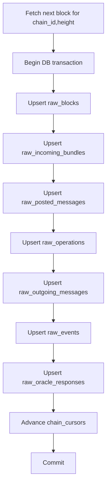

# Observability Storage Model

Type: Primitive
Audience: Coding assistants
Authority: High

## Purpose

Canonical object model, keys, and persistence rules for the observability system.

## Facts

- Layer 1 follows `linera-explorer-new` object boundaries
- Raw tables are canonical for chain facts
- Existing product tables remain derived consumers, not raw fact stores
- Raw ingestion must be replay-safe and idempotent

## Semantics

- Primary block identity:
  - `block_hash`
- Primary chain progress key:
  - `chain_id + height`
- Incoming bundle target-side key:
  - `target_block_hash + bundle_index`
- Incoming bundle source-side key:
  - `origin_chain_id + source_cert_hash + transaction_index`
- Posted message external identity:
  - `origin_chain_id + source_cert_hash + transaction_index + message_index`
- Outgoing message identity:
  - `block_hash + transaction_index + message_index`
- Event identity:
  - `block_hash + transaction_index + event_index`
- Oracle response identity:
  - `block_hash + transaction_index + response_index`

## Flow

## Rules

- Do not advance `chain_cursors` until the full block and all Layer 1 children are committed
- Do not overwrite conflicting rows with the same identity key
- Do not treat `Reject` as an ingestion error
- Do not infer business success in raw tables
- Do not mix raw chain fact columns into product-facing `transactions` or `pool` tables unless used only as back-references

## Checklist

1. Add raw tables:
   - `chain_cursors`
   - `raw_blocks`
   - `raw_incoming_bundles`
   - `raw_posted_messages`
   - `raw_operations`
   - `raw_outgoing_messages`
   - `raw_events`
   - `raw_oracle_responses`
2. Add unique keys matching the semantics section
3. Make raw writes block-atomic per `chain_id + height`
4. Make replay rely on database uniqueness, not memory state
5. Record conflicting-key mismatches as ingestion anomalies

## Validation

- Replaying the same block twice must not create duplicate Layer 1 rows
- Replaying a chain range after restart must leave Layer 1 unchanged except for new heights
- A `Reject` bundle must persist as a normal fact row with `action = Reject`
- Conflicting `(chain_id, height)` with different `block_hash` must stop cursor advancement

## Sources

- `https://github.com/linera-io/linera-protocol/blob/main/linera-explorer-new/server-rust/src/models.rs`
- `https://github.com/linera-io/linera-protocol/blob/main/linera-explorer-new/server-rust/src/db.rs`
- `agents/context/observability-architecture.md`
