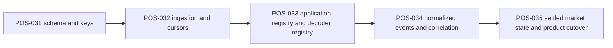

# Observability Deliverables

Type: Runbook
Audience: Coding assistants
Authority: High

## Purpose

Canonical execution contract for `POS-031` through `POS-035`.

## Facts

- This file defines per-task deliverables, boundaries, and acceptance checks
- Live status remains only in `agents/tasks/board.yaml`
- Canonical architecture is `agents/context/observability-architecture.md`
- Canonical schema and semantics remain in the existing `agents/primitives/*` observability docs

## Rules

- Do not merge deliverables from multiple layers into one implementation task
- Do not start Layer 2 business derivation before Layer 1 replay and cursor semantics are stable
- Do not start Layer 3 product cutover before `settled_trade` and `settled_liquidity_change` are explicit
- Do not let `latestTransactions` participate in parity decisions once Layer 3 shadow outputs exist

## Flow

## Deliverables

### `POS-031`

- Scope:
  - Layer 1 MySQL schema only
- Required outputs:
  - DDL for `chain_cursors`
  - DDL for raw tables under `agents/primitives/observability-schema.md`
  - unique-key and secondary-index plan
  - write-transaction boundary for one block
- Explicit non-goals:
  - no decoder logic
  - no business-event columns
  - no candle or position derivation
- Acceptance:
  - every Layer 1 row has a stable identity key
  - `round` is absent from primary key, unique key, and cursor design
  - one block can be inserted atomically with all nested rows

### `POS-032`

- Scope:
  - chain ingestion worker logic
  - replay and catch-up logic
- Required outputs:
  - per-chain fetch loop by `chain_id + height`
  - block-atomic persistence into Layer 1
  - idempotent replay behavior on duplicate fetch
  - cursor advancement rules
  - lag and failure diagnostics
- Explicit non-goals:
  - no application decoding
  - no Layer 2 normalization
- Acceptance:
  - restart resumes from `chain_cursors`
  - duplicate fetch does not create duplicate rows
  - failed block write does not partially advance cursor state

### `POS-033`

- Scope:
  - application identity discovery
  - decoder dispatch only
- Required outputs:
  - persistent `application_registry`
  - in-process `decoder_registry`
  - registry bootstrap and update rules
  - decoder invocation contract:
    - input raw fact kind
    - input `application_id`
    - input raw bytes
    - output decoded payload or decode failure
- Explicit non-goals:
  - no Layer 3 product derivation
  - no separate decoder microservice
- Acceptance:
  - unknown `application_id` is queryable as unresolved
  - missing decoder is queryable as unimplemented
  - decode failure does not block Layer 1 or future re-decode

### `POS-034`

- Scope:
  - Layer 2 normalized event materialization
- Required outputs:
  - normalized event families
  - correlation-key contract
  - reject mapping rules
  - decode-failure event rules
  - business observation event rules for known app types
- Explicit non-goals:
  - no product-facing candles or positions tables
  - no reliance on `latestTransactions`
- Acceptance:
  - each normalized event is reproducible from Layer 1 plus decoder output
  - `Reject` remains visible as a first-class normalized fact
  - normalized replay is idempotent

### `POS-035`

- Scope:
  - Layer 3 settled outputs
  - product cutover planning and execution
- Required outputs:
  - `settled_trade` contract
  - `settled_liquidity_change` contract
  - derived table or materialized-view plan for:
    - `transactions`
    - `candles`
    - `positions`
    - `fees`
    - `pool`
  - shadow-comparison plan against current outputs
  - `latestTransactions` removal plan
- Explicit non-goals:
  - no raw-byte parsing
  - no contract-side semantic changes
- Acceptance:
  - candles consume only `settled_trade`
  - positions and fees are explainable from Layer 3, then Layer 2, then Layer 1
  - correctness-critical paths no longer depend on `latestTransactions`

## Module Boundaries

- Ingestion worker:
  - owns `POS-032`
  - reads chain APIs
  - writes Layer 1
- Registry and decode module:
  - owns `POS-033`
  - reads Layer 1 plus `application_registry`
  - emits decode results
- Normalizer:
  - owns `POS-034`
  - reads Layer 1 plus decode results
  - writes Layer 2
- Market derivation:
  - owns `POS-035`
  - reads Layer 2
  - writes Layer 3 and product-facing outputs

## Validation

- `POS-031`:
  - schema review against explorer-style identities
- `POS-032`:
  - duplicate replay test
  - restart-resume test
  - partial-failure rollback test
- `POS-033`:
  - registry miss test
  - missing decoder test
  - decode-failure reprocess test
- `POS-034`:
  - reject visibility test
  - correlation stability test
  - idempotent normalization test
- `POS-035`:
  - candle parity test from `settled_trade`
  - transactions parity test from Layer 3
  - positions and fees explainability test

## Sources

- `agents/context/observability-architecture.md`
- `agents/primitives/observability-schema.md`
- `agents/primitives/application-decoding.md`
- `agents/primitives/normalized-event-model.md`
- `agents/primitives/derived-market-state.md`
- `agents/runbooks/observability-implementation.md`
- `agents/runbooks/observability-migration.md`
- `agents/tasks/board.yaml` (`POS-031`, `POS-032`, `POS-033`, `POS-034`, `POS-035`)
