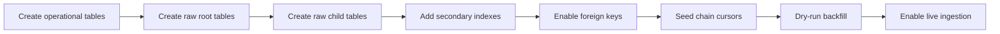

# Observability Layer 1 Rollout

Type: Runbook
Audience: Coding assistants
Authority: High

## Purpose

Canonical migration-ready rollout sequence for Layer 1 schema and operational tables.

## Facts

- This file is the execution order for implementing `POS-031`
- Logical schema lives in:
  - `agents/primitives/observability-schema.md`
  - `agents/primitives/observability-layer1-ops.md`
- This file defines rollout order, not semantic meaning
- First rollout target is additive migration only

## Rules

- Do not mix Layer 1 DDL rollout with Layer 2 or Layer 3 table rollout
- Do not enable ingestion workers before all required Layer 1 tables and indexes exist
- Do not add foreign keys before parent tables and parent indexes are in place
- Do not backfill history before anomaly tables and cursor tables exist
- Do not make destructive changes to existing `service/kline` product tables during Layer 1 rollout

## Flow

## DDL Order

### Phase 0: Preconditions

1. Confirm MySQL version supports:
   - `datetime(6)`
   - `json`
   - required index lengths for `varchar`
2. Confirm existing product tables remain untouched
3. Confirm naming does not collide with existing tables

### Phase 1: Operational Tables First

1. Create `chain_cursors`
2. Create `processing_cursors`
3. Create `ingestion_anomalies`
4. Optionally create `raw_block_ingest_runs`

Reason:
- ingestion must have somewhere to persist state and anomalies before raw writes begin

### Phase 2: Raw Root Table

1. Create `raw_blocks`
2. Add:
   - primary key on `block_hash`
   - unique key on `(chain_id, height)`
   - time and chain indexes

Reason:
- all child tables depend on block identity

### Phase 3: Raw Child Tables Without Foreign Keys

1. Create `raw_incoming_bundles`
2. Create `raw_posted_messages`
3. Create `raw_operations`
4. Create `raw_outgoing_messages`
5. Create `raw_events`
6. Create `raw_oracle_responses`

Reason:
- first create all tables and uniqueness contracts
- add foreign keys only after structure is stable

### Phase 4: Secondary Indexes

1. Add application lookup indexes
2. Add chain-height indexes
3. Add source-certificate indexes
4. Add stream/blob lookup indexes
5. Add anomaly status and cursor status indexes

Reason:
- keeps table-creation step simple
- makes index rollout explicit and measurable

### Phase 5: Foreign Keys

1. `raw_incoming_bundles.target_block_hash -> raw_blocks.block_hash`
2. `raw_posted_messages.bundle_id -> raw_incoming_bundles.bundle_id`
3. `raw_operations.block_hash -> raw_blocks.block_hash`
4. `raw_outgoing_messages.block_hash -> raw_blocks.block_hash`
5. `raw_events.block_hash -> raw_blocks.block_hash`
6. `raw_oracle_responses.block_hash -> raw_blocks.block_hash`

Reason:
- child integrity is enforced only after all parent tables and indexes exist

## Seed And Backfill Order

### Cursor Seeding

1. insert tracked `chain_id` rows into `chain_cursors`
2. initialize:
   - `last_finalized_height = null`
   - `sync_status = idle`
   - `consecutive_failures = 0`

### Historical Backfill

1. choose a limited chain set
2. choose a bounded height range
3. run backfill in `replay` mode
4. verify:
   - raw row counts
   - no open anomalies for replay-safe data
   - `chain_cursors` advanced correctly
5. widen range only after validation

### Live Enablement

1. enable ingestion for selected chains only
2. observe:
   - cursor movement
   - anomaly creation
   - transaction duration
3. expand chain set after stable operation

## Rollback Rules

- If DDL creation fails before ingestion starts:
  - fix migration and rerun
- If backfill creates unexpected open anomalies:
  - stop before enabling live ingestion
  - inspect `ingestion_anomalies`
  - do not manually advance `chain_cursors`
- If live ingestion fails after deployment:
  - disable workers
  - keep Layer 1 tables for diagnosis
  - do not drop anomaly evidence

## Validation Gates

### Gate 1: DDL Complete

- all Layer 1 and operational tables exist
- all required unique keys exist
- all required secondary indexes exist

### Gate 2: Integrity Complete

- all foreign keys are present
- insert order works for one synthetic block
- rollback works for one forced failure

### Gate 3: Replay Complete

- replaying one block produces no duplicate rows
- replaying one range creates no spurious anomalies
- content-conflict path creates anomaly and stops cursor movement

### Gate 4: Live Ready

- cursor seeding completed
- dry-run backfill validated
- monitoring queries for cursor lag and open anomalies exist

## Deliverables

- migration sequence for `POS-031`
- explicit table-creation order
- explicit index and foreign-key order
- explicit backfill and live-enable order
- rollout gates for handing off to `POS-032`

## Sources

- `agents/primitives/observability-schema.md`
- `agents/primitives/observability-layer1-ops.md`
- `agents/runbooks/observability-deliverables.md`
