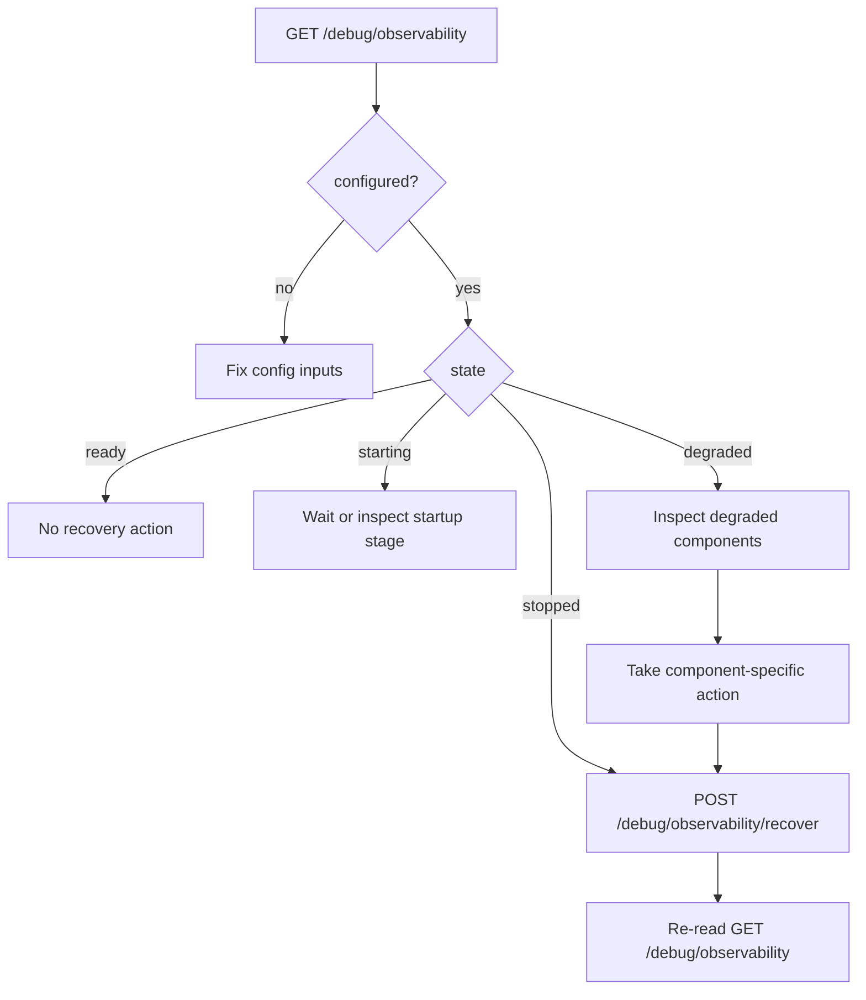

# Observability Fail-Open Operations

Type: Skill
Audience: Coding assistants
Authority: High

## Purpose

Canonical operator-facing recovery and diagnosis rules for the same-process fail-open observability subsystem inside `service/kline`.

## Facts

- `service/kline` query serving must remain live even when observability is degraded
- Observability is not a separate process or deployment
- The canonical runtime state is exposed through `GET /debug/observability`
- The canonical in-process recovery entrypoint is `POST /debug/observability/recover`

## Rules

- Do not recommend restarting the whole `service/kline` process as the first recovery action when in-process observability recovery is available
- Do not treat observability degradation as proof that query serving is unhealthy
- Do not hide which startup component failed; always preserve component-level degraded status
- Do not use cron as the recovery mechanism; use explicit recover, explicit catch-up, or the native notification/reconnect path
- Do not let future decode, normalize, or derive workers introduce a second health surface; they must extend the same component-level observability status

## Status Semantics

### Top-Level States

- `disabled`
  - observability is not configured
  - query serving may still be healthy
- `stopped`
  - observability is configured but not started
- `starting`
  - background startup is in progress
- `ready`
  - observability runtime is started and operator reads may proceed
- `degraded`
  - one or more observability stages failed
  - query serving must still remain available

### Component States

- `schema`
  - MySQL schema creation or validation
- `registry`
  - application registry seed/bootstrap
- `startup_catch_up`
  - startup reconciliation catch-up
- `listener`
  - GraphQL WebSocket notification listener
- `debug_export`
  - diagnostics read/export path itself
- `decode_scheduler`
  - reserved worker component for POS-033 and later
- `normalizer`
  - reserved worker component for POS-034 and later
- `market_deriver`
  - reserved worker component for POS-035 and later

## Recovery Flow

## Component-Specific Actions

### `schema`

- Primary checks:
  - MySQL reachability
  - table capacity
  - DDL permissions
  - storage exhaustion
- Expected action:
  - fix storage or permissions first
  - then call `POST /debug/observability/recover`

### `registry`

- Primary checks:
  - configured application ids
  - registry table availability
  - seed input correctness
- Expected action:
  - fix config or registry persistence issue
  - then call `POST /debug/observability/recover`

### `startup_catch_up`

- Primary checks:
  - chain GraphQL reachability
  - chain id scope
  - explicit catch-up behavior
- Expected action:
  - repair upstream connectivity or chain scope
  - optionally use `POST /debug/catch-up/run`
  - then call `POST /debug/observability/recover` if runtime remains degraded

### `listener`

- Primary checks:
  - GraphQL WebSocket endpoint
  - reconnect path
  - subscription authorization or routing
- Expected action:
  - repair WebSocket connectivity
  - then call `POST /debug/observability/recover`

### `debug_export`

- Primary checks:
  - raw repository read path
  - diagnostics query cost
  - MySQL read availability
- Expected action:
  - do not assume ingestion itself is down
  - fix diagnostics read failure
  - then re-read `GET /debug/observability`

## Acceptance

- Query API startup remains independent from observability startup success
- Operator can identify the failed observability stage from one status read
- Operator can trigger in-process observability recovery without restarting the query service
- Recovery guidance stays aligned with component-level degraded status

## Sources

- `agents/context/kline-service-architecture.md`
- `agents/primitives/observability-interfaces.md`
- `agents/skills/observability-deliverables/SKILL.md`
- `agents/tasks/board.yaml`
